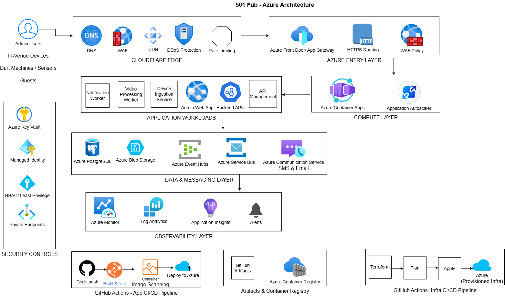

# 501 Fun DevOps Interview Task

## High-Level Architecture



## 1. Overview

This repository contains a proposed Azure infrastructure design with Cloudflare at the edge for hosting:
- Web app for central configuration
- Backend APIs
- Log ingestion and processing from in-venue devices
- Video processing and serving for in-game moments
- SMS and email communication to guests
- Asynchronous communication between devices and backend

## 2. Architecture Summary

Cloudflare is used at the edge for DNS, WAF, DDoS protection, CDN caching, bot protection and rate limiting. Traffic is routed into Azure through Azure Entry Layer, then to Azure Container Apps hosting the web app, APIs and background workers.

Event Hubs is used for high-volume log ingestion, Service Bus is used for business messaging and asynchronous workflows, Blob Storage is used for video assets, and Azure Monitor/Application Insights provide observability.

## 3. Key Azure Services

| Area | Service |
|---|---|
| Edge | Cloudflare |
| Compute | Azure Container Apps |
| API management | Azure API Management |
| Async messaging | Azure Service Bus |
| Event ingestion | Azure Event Hubs |
| Video storage | Azure Blob Storage |
| Video processing | Container Apps worker |
| Database | Azure Database for PostgreSQL |
| Secrets | Azure Key Vault |
| Monitoring | Azure Monitor, Log Analytics, Application Insights |
| CI/CD | GitHub Actions |
| IaC | Terraform |

## Why Azure Container Apps?

Azure Container Apps is selected for the first version because it supports containerised workloads, autoscaling, revisions, environment-based deployment and event-driven scaling without the operational overhead of managing a full Kubernetes cluster.

AKS would be considered if the platform later needed advanced Kubernetes networking, service mesh, custom controllers or complex multi-tenant orchestration.

## CI/CD Approach

Two pipeline types are included:

### Application Pipeline

The application pipeline performs:

1. Checkout code
2. Run tests
3. Build Docker image
4. Scan image
5. Push image to Azure Container Registry
6. Deploy image to Azure Container Apps

### Infrastructure Pipeline

The infrastructure pipeline performs:

1. Terraform format check
2. Terraform validate
3. Terraform plan on pull request
4. Terraform apply after merge to main
5. Manual approval for production environments

## Infrastructure as Code

Terraform is used to provision Azure resources in a repeatable and consistent way.

The Terraform code is structured into reusable modules:

- networking
- security
- container-apps
- eventing
- storage
- database
- monitoring

## Security

Security is built into the design using:

- Cloudflare WAF, DDoS protection, bot protection and rate limiting
- HTTPS-only access
- Azure Key Vault for secrets
- Managed identities for Azure service-to-service authentication
- Private endpoints for sensitive services
- Least privilege RBAC
- Container image scanning in CI/CD
- No long-lived cloud credentials in pipelines
- GitHub Actions OIDC authentication to Azure

## Scalability

The platform scales through:

- Cloudflare CDN caching at the edge
- Azure Container Apps autoscaling
- Event Hubs partitioning for high-volume ingestion
- Service Bus queues for asynchronous processing
- Blob Storage for scalable video storage
- Independent scaling of APIs, workers and ingestion services

## Reliability and Resiliency

Reliability is improved through:

- Event-driven architecture
- Queue-based retry patterns
- Dead-letter queues
- Health checks
- Immutable container image tags
- Infrastructure as Code
- Backup and recovery policies
- Multi-zone deployment where supported
- Monitoring and alerting

## Observability

Observability is provided through:

- Application Insights for application performance
- Azure Monitor for infrastructure metrics
- Log Analytics for central log querying
- Alerts for latency, error rate, queue depth, failed jobs and resource saturation
- Dashboards for service health, traffic, ingestion volume and video processing status

## Automation

Automation is provided through:

- Terraform for infrastructure provisioning
- GitHub Actions for CI/CD
- Automated testing
- Container image scanning
- Automated deployment to Azure Container Apps
- Terraform plan/apply workflow
- Environment approval gates for production

## Note

This submission is intended to demonstrate the proposed architecture, Infrastructure as Code structure, CI/CD approach and design reasoning. It is not intended to be a fully production-ready deployment without further environment-specific configuration, security hardening and testing.

## Repository Structure

```text
501-fun-devops-design/
├── architecture/
│   ├── 501-fun-azure-architecture.drawio
│   └── 501-fun-azure-architecture.png
├── docs/
│   ├── assumptions-and-tradeoffs.md
│   ├── observability.md
│   ├── scalability-reliability.md
│   └── security.md
├── infra/
│   └── terraform/
│       ├── providers.tf
│       ├── main.tf
│       ├── variables.tf
│       ├── outputs.tf
│       ├── terraform.tfvars
│       └── modules/
├── pipelines/
│   ├── app-ci-cd.yml
│   └── infra-ci-cd.yml
├── .gitignore
└── README.md


